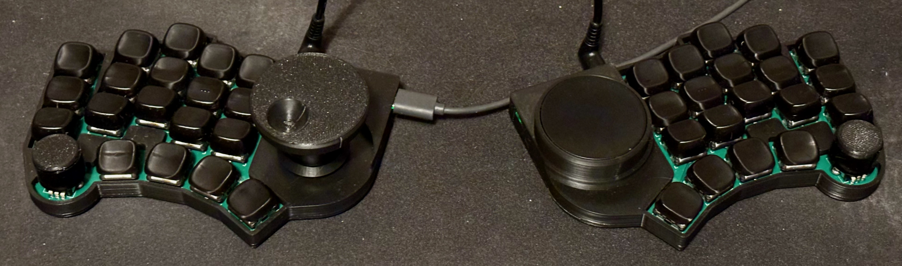

# zen_kb

"Maximalist" ergo mech split keyboard. 38-keys, 3 rotary encoders, 1 trackpad. My last keyboard was mu (無), meaning nothing. Since this adds a lot of extra bells and whistles, I've named it zen (全), meaning all. This keyboard is meant to be much more "finished" than mu. With that said, this is still an eternal work in progress. The hardware is finished, at least. The config is a never ending journey.

## Firmware
Firmware is located in qmk_firmware. Keymaps are based on Miryoku (manna-harbour/miryoku), with my own customizations, of course.

## Bill of materials

Kailh Choc V1 key switches x 38
 KB2040 x 2 (MCU - runs on 3.3v, important for trackpad)
 1N4148 MiniMELF diode x 38
 TRRS-PJ-320A x 2 (TRRS jacks)
 Alps EC12E2440301 x 2 (Mini encoders)
 Alps EC12E24404A8 x 1 (Jog wheel encoder)
 Cirque TM040040-2024-303 x 1 (trackpad)
 Molex 505110-1297 x 1
 .50 mm pitch type B FFC x 1
 M2*6mm screws, hex socket head x 12
 M2 heat set inserts x 12

## Other
I recommend putting some sort of grip tape around the knobs. I'm using self-fusing silicone tape, but anything should work.
